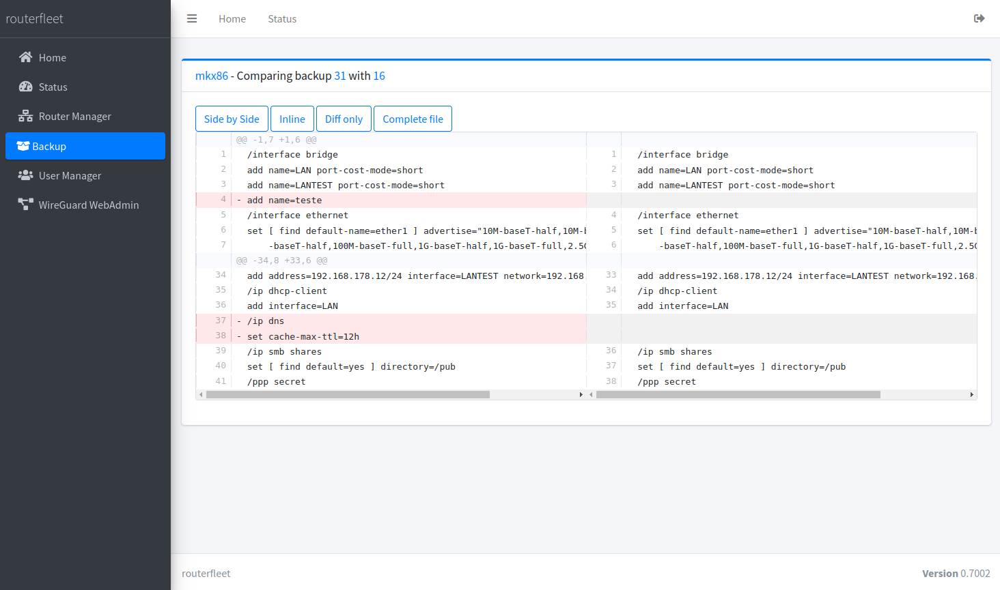
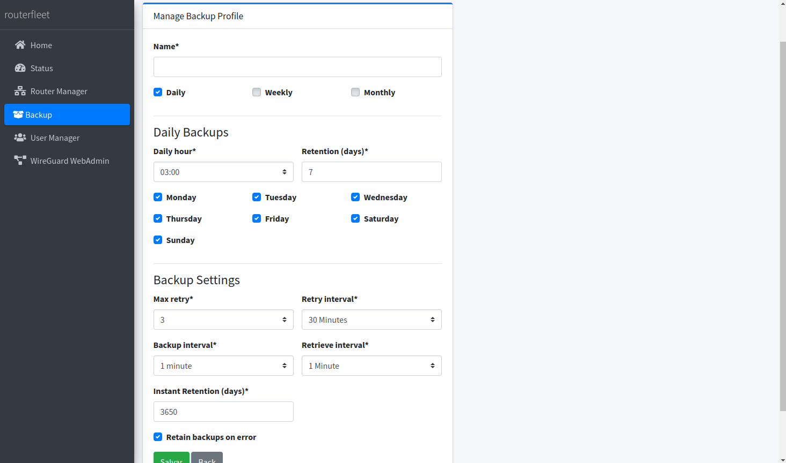
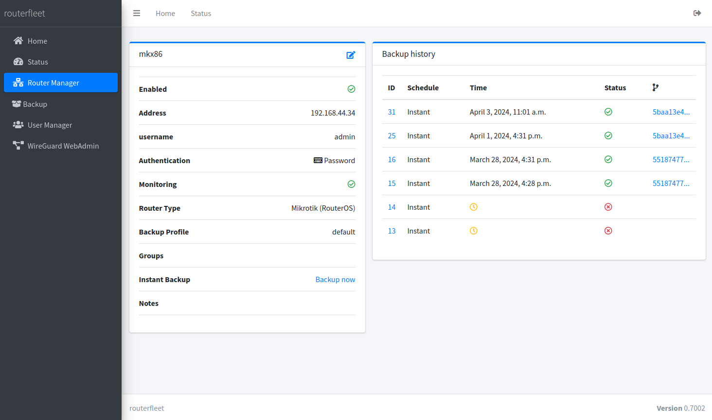
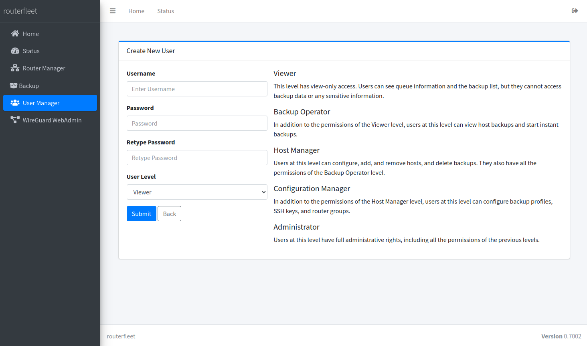

# RouterFleet

Welcome to **RouterFleet** - the next step in centralized router backup and management. This open source project is designed to revolutionize the way we handle backups and configurations for routers and network equipment, focusing primarily on simplifying and securing network management tasks.

## Introduction

**RouterFleet** is developed with the aim of easing the management of a fleet of devices, particularly focusing on Mikrotik devices during its initial launch phase. This project is a testament to countless hours of dedication towards developing a system that not only simplifies but also secures network management tasks across various devices.

## Features

- **Centralized Backup Management:** Easily manage backups for your routers and network equipment from a single interface.
- **Backup diffing:** Compare backups to identify changes and track configuration history.
- **Multiple backup profiles:** Create multiple backup profiles to manage different schedules and retention polices.
- **Mikrotik Device Compatibility:** Initial support for Mikrotik devices with plans to expand based on community feedback.
- **Continuous Updates:** Regular updates to introduce new functionalities, performance enhancements, and bug fixes.
- **Integration with wireguard:** Integration with [wireguard_webadmin](https://github.com/eduardogsilva/wireguard_webadmin) to easily manage WireGuard VPNs.
- **Open Source:** Dive into the code, contribute, and be a part of a growing community.

## Screenshots
### Backup comparison view (diff)
Easily compare backups to identify changes and track configuration history.

### Multiple Backup Profiles
Create multiple backup profiles to manage different schedules and retention policies.

### Router Details
View detailed information about your routers, including the complete backup history.

### User Management
Manage users and their permissions to ensure secure access to RouterFleet.



## Getting Started

To get started with RouterFleet, you'll want to clone the repository and set up your environment. Here's a quick guide:

### Step 1: Clone the Repository

First, clone the RouterFleet repository to your local machine or server:

```bash
git clone https://github.com/eduardogsilva/routerfleet.git
cd routerfleet
```

### Step 2: Deploy with Docker

Use the following command to start your RouterFleet server. This command will also build the Docker image if it's the first time you're running it, or if there have been changes to the Dockerfile:

```bash
SERVER_ADDRESS=yourserver.example.com POSTGRES_PASSWORD=your_password docker compose up --build -d
```

During the deployment, a self-signed certificate will be automatically generated for use with HTTPS. If you prefer to use your own certificates, proceed to the next step.

### Step 3: Update SSL Certificates (Optional)

If you have your own SSL certificates and wish to use them instead of the self-signed certificate, follow these instructions:

- Navigate to the certificates volume.
- Replace `nginx.pem` and `nginx.key` with your certificate and key files, respectively.

**Note:** If your server does not have a DNS name and you're using an IP address, set the `SERVER_ADDRESS` variable to your server's IP address (`SERVER_ADDRESS=ip_address`).

### Step 4: Access the Web Interface

Open a web browser and navigate to `https://yourserver.example.com` to access the RouterFleet web interface. 

**Important:** If you are using the self-signed certificate, your browser will present a certificate exception warning. You must accept this exception to proceed to the RouterFleet interface.


## Upgrade Instructions for RouterFleet

To maintain security, performance, and access to new features in RouterFleet, it's important to follow these steps when upgrading:

1.**Backup Database**

   Before starting the upgrade, it's crucial to back up your database. This step ensures you can revert to the previous state if the upgrade encounters problems. For the database, we recommend manually running a `pg_dump` command to create a backup.


2.**Preparation:**

   Navigate to your RouterFleet directory on your machine or server:
   ```bash
   cd path/to/routerfleet
   ```

3.**Shutdown Services:**

   Prevent data loss by stopping all RouterFleet services gracefully:
   ```bash
   docker compose down
   ```

4.**Fetch the Latest Updates:**

   Update your local repository to get the latest RouterFleet version:
   ```bash
   git pull origin main
   ```

5.**Deploy the Updated Version:**

   With the latest updates in place, re-deploy RouterFleet using Docker Compose. This step rebuilds the Docker image to incorporate any changes:
   ```bash
   SERVER_ADDRESS=yourserver.example.com POSTGRES_PASSWORD=your_password docker compose up --build -d
   ```

6.**Verify Operation:**

   After restarting the services, check the RouterFleet web interface to ensure all functions are operating correctly. Examine the application logs for errors or warnings:
   ```bash
   docker compose logs
   ```

7.**Post-Upgrade Checks:**

   - Review the application and system logs carefully for any anomalies.
   - If you encounter any issues, consider reporting them on [GitHub Issues](https://github.com/eduardogsilva/routerfleet/issues) or seek advice in [Discussions](https://github.com/eduardogsilva/routerfleet/discussions). If necessary, revert to your earlier backup.

Following these instructions will help ensure a smooth upgrade process for your RouterFleet installation, keeping it secure and efficient.


## Contributing

As an open source project, RouterFleet thrives on community support. Whether you're a developer, a network engineer, or just someone interested in network management, there are many ways you can contribute:

- **Code Contributions:** Submit pull requests with bug fixes, new features, and improvements.
- **Feedback:** Share your experiences, suggest improvements, and help shape the future of RouterFleet.
- **Documentation:** Help improve the documentation to make RouterFleet more accessible to everyone.
- **Testing:** Report bugs, test new features, and help ensure RouterFleet is stable and reliable.


## Support and Community

Join our community to get support, share ideas, and collaborate:

- [GitHub Issues](https://github.com/eduardogsilva/routerfleet/issues) for reporting bugs and feature requests.
- [Discussions](https://github.com/eduardogsilva/routerfleet/discussions) for sharing ideas and getting help from the community.

Your support and involvement are crucial in shaping the future of RouterFleet. Let's make network management easier and more secure together!

## License

RouterFleet is released under the [MIT License](LICENSE). Feel free to explore, modify, and distribute the software as per the license agreement.

---

We look forward to your contributions and are excited to see how RouterFleet evolves with your help and feedback. Let's build a robust community around efficient and secure network management. Thank you for your support!
